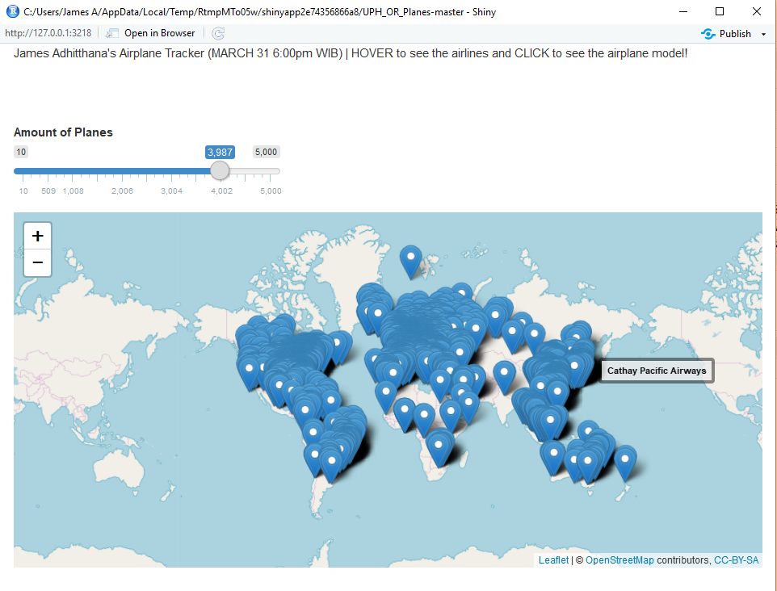

# UPH_OR_Planes

shiny::runGitHub("jamesadhitthana/UPH_OR_Planes") #Copy this into RStudio console to run the app

James Adhitthana's Airplane Tracker (MARCH 31 6:00pm WIB)

* HOVER to see the airlines

* CLICK to see the airplane model!
